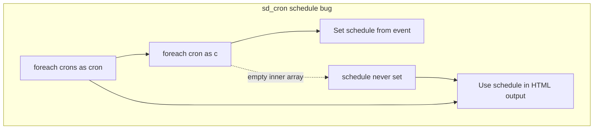

# Fix Three PHP Deprecations and Warnings

All issues are in [`admin/class-system-dashboard-admin.php`](admin/class-system-dashboard-admin.php).

| Log entry | Line | Cause |
|-----------|------|-------|
| Undefined variable `$schedule` | 3266 (also 3257) | `$schedule` is only set inside the inner `foreach ( $cron as $c )`; if that loop never runs, the outer loop still uses `$schedule` when building HTML |
| `E_STRICT` deprecated (PHP 8.4) | 2091 | `sd_error_reporting()` calls `constant( 'E_STRICT' )`; PHP 8.4 removed this error level and deprecates referencing the constant |
| Float `0.25` to int in `sleep()` | 7938 (also 7807) | `sleep()` requires whole seconds; passing `0.25` triggers implicit float-to-int conversion deprecation in PHP 8.1+ |



---

## Fix 1: Undefined `$schedule` in `sd_cron()` (~3239–3271)

**Root cause:** In `sd_cron()`, each cron hook’s events live in `$cron`. The code assumes the inner loop always runs:

```3241:3251:admin/class-system-dashboard-admin.php
			foreach( $cron as $c ) {
				$schedule_array = array_column($c, 'schedule');
				if ( !empty( trim( $schedule_array[0] ) ) ) {
					$schedule = esc_attr( $schedule_array[0] );
				} else {
					$schedule = 'singlerun';
				}
			}
```

When `$cron` has no child entries (or structure differs), `$schedule` is never defined before lines 3257 and 3266.

**Planned change:**

1. At the start of each outer `foreach ( $crons as $cron )` iteration, default: `$schedule = 'singlerun';`
2. Harden schedule extraction with `isset( $schedule_array[0] )` before reading index `0`, avoiding a secondary “undefined array key” warning when `array_column()` returns an empty array.

This matches WordPress’s pattern where one-off events use an empty schedule (displayed as “singlerun” in the existing logic).

---

## Fix 2: `E_STRICT` deprecation in `sd_error_reporting()` (~2070–2096)

**Root cause:** The levels map includes `'E_STRICT'`, and the loop calls `constant( $level )` when `defined( $level )` is true. On PHP 8.4+, `E_STRICT` still exists for backward compatibility but using it via `constant()` emits a deprecation.

**Planned change:**

- Remove `'E_STRICT' => false` from the `$levels` array when running on PHP 8.4+ (`PHP_VERSION_ID >= 80400`), **or** skip that key in the foreach before calling `constant()`.
- Prefer conditional exclusion at array build time so the UI does not list a removed error level on PHP 8.4+.

Example approach:

```php
$levels = array(
    // ... existing levels except E_STRICT on 8.4+
);
if ( PHP_VERSION_ID < 80400 ) {
    $levels['E_STRICT'] = false;
}
```

No change needed for PHP versions below 8.4.

---

## Fix 3: `sleep(0.25)` float precision deprecation (~7807, 7938)

**Root cause:** `sleep()` accepts only integer seconds. `sleep(0.25)` was intended as a 250ms delay after `shell_exec()` while hook JSON files are written, in `sd_hooks()` for both plugin and theme hook generation.

**Planned change:**

Replace both occurrences:

```php
sleep( 0.25 );
```

with:

```php
usleep( 250000 ); // 0.25 seconds
```

`usleep()` takes microseconds and avoids float-to-int conversion. Comment can stay as-is (still accurate).

Locations:
- ~7807 (plugin hooks generation)
- ~7938 (theme hooks generation)

---

## Testing plan

On PHP 8.4+ with `WP_DEBUG_LOG` enabled:

1. Open System Dashboard sections that show **Error Reporting** — confirm no `E_STRICT` deprecation.
2. Open **Cron** (core and custom lists) — confirm no `$schedule` warnings; hooks with one-off or empty schedules show `singlerun`.
3. Trigger **Hooks** generation for an active plugin/theme (accordion that runs `sd_hooks` AJAX) — confirm no `sleep(0.25)` deprecation; JSON files still load after the short delay.

Optional: repeat on PHP 8.1–8.3 to confirm `E_STRICT` still appears in error reporting on older PHP.

---

## Files to change

| File | Changes |
|------|---------|
| [`admin/class-system-dashboard-admin.php`](admin/class-system-dashboard-admin.php) | `sd_cron()`, `sd_error_reporting()`, two `sleep()` calls in `sd_hooks()` |
| [`.cursor/plans/fix_php_warnings_ad2bb3f3.plan.md`](.cursor/plans/fix_php_warnings_ad2bb3f3.plan.md) | Append “summary of changes” after build (per project convention) |

No new dependencies or loader changes required.

# BUILD

All three fixes are in [`admin/class-system-dashboard-admin.php`](admin/class-system-dashboard-admin.php). PHP syntax checks pass.

### 1. Undefined `$schedule` in `sd_cron()` (line ~3266)
- Set `$schedule = 'singlerun'` at the start of each outer cron loop.
- Use `isset( $schedule_array[0] )` before reading the schedule from `array_column()`.

### 2. `E_STRICT` deprecated on PHP 8.4 (line ~2091)
- Removed `E_STRICT` from the base `$levels` array.
- Add it only when `PHP_VERSION_ID < 80400`, so `constant( 'E_STRICT' )` is never called on PHP 8.4+.

### 3. `sleep(0.25)` float precision (lines ~7807, ~7938)
- Replaced both `sleep(0.25)` calls with `usleep( 250000 )` (250 ms) in plugin and theme hook generation.

**Quick verification:** Reload Error Reporting, Cron, and Hooks sections on PHP 8.4+ with debug logging enabled; those three log entries should no longer appear.